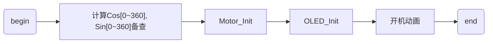
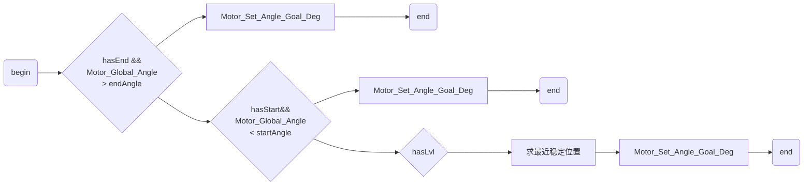
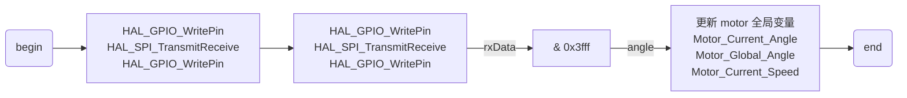
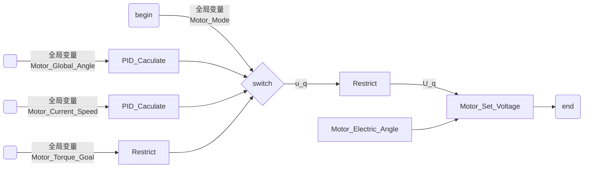
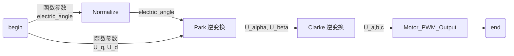
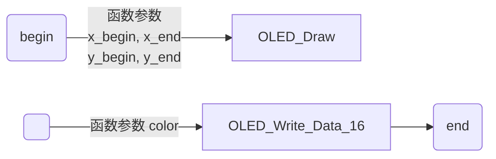
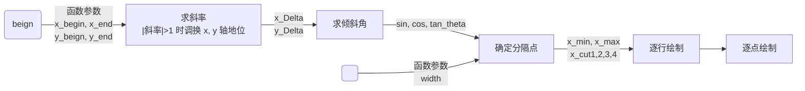
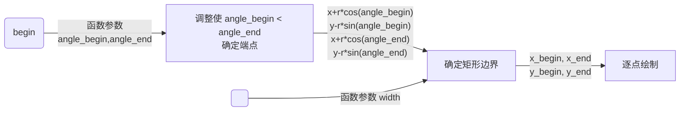

# 技术报告：智能旋钮

无 12 班	潘确然    2021012643
无 13 班	兰琪	    2021012693


## 一、电路设计


​       电路分为降压电路、单片机外部电路、usb转uart电路、电机驱动电路4个部分，详细设计如下：

### 1. 降压电路：


* 由于无刷电机驱动芯片需要 12V 电源输入，为简化电路设计，电源方案采用 DC 12V 输入，用于驱动无刷电机；

* 使用 lm2596 芯片产生 5V 电源，用于磁编码器的供电；

* 使用 ams1117 芯片将 5v 降至 3.3v ，用于驱动其余模块和芯片。

### 2. 单片机外部电路：


​       为保证单片机运行稳定性，采用外部晶振驱动单片机，其余电路均为标准设计，不再赘述。

### 3. usb 转 uart 电路：


​       采用 ch340k 芯片。由于前期设计时忘记加入去耦电容，因而在电机转动较快时会无法通信。为此，在 pcb 的焊接过程中为其添加了 100μF 的去耦电容，并用飞线为其单独连接地线。

### 4. 电机驱动电路：


​       采用成熟的 drv8313 芯片方案，使用单片机 pwm 控制。

### 5. PCB


## 二、软件设计

### 1. main


​       在 STM32CubeMX 生成的基础框架上设计了单片机程序，开发环境选用 MDK-ARM。`main()` 中包含：

1. 初始化函数 `Knob_Init()`



​       其中开机动画为从 (10,10) 到 (227,227) ，(10,227) 到 (227,10) 的两条宽度为 10 的白线，因 OLED 屏幕绘图有限，最终呈现出从左上到右下画线，从右上到左下画线，再从上到下擦除的过程。


2. 在串口中断回调函数中调用 `Knob_UART()`

​       串口接收使用 DMA 方式，接收到的数据储存在 `uartBuf[30]` ，编码方式如下：

| 编码            | 变量                               |
| --------------- | ---------------------------------- |
| `uartBuf[0]`    | `0 0 0 0 0 hasLvl hasEnd hasStart` |
| `uartBuf[1- 4]` | `lvlAngle`                         |
| `uartBuf[5- 8]` | `startAngle`                       |
| `uartBuf[9-12]` | `endAngle`                         |
| `uartBuf[13]`   | `Draw_Mode`                        |

​       其中 `hasLvl` 限制是否有起点，如果 `hasLvl` 有效，当角度小于 `startAngle` 是，电机角度目标值将被设为 `startAngle` ，`hasEnd` 类似。

​       `hasLvl` 限制是否模拟挡位或棘轮手感。当 `hasLvl` 有效时，电机将以 `lvlAngle` 为步长，将从 `startAngle` 到 `endAngle` 的角度范围等分，取距离当前位置最近的分隔点作为电机的角度目标值，从而模拟有限个稳定位置的旋钮手感。当 `LvlAngle` 较大时，旋钮手感近似为多档开关；当 `LvlAngle` 较小 (1°~2°) 时，旋钮可以近似地自由转动，转动过程有粗糙的颗粒感，我们暂且称之为棘轮手感。

​       `Draw_Mode` 限制 OLED 绘图形式，如显示线段、圆、圆弧、数字等。当 `Draw_Mode` 取值发生改变时增加一次清屏任务 `clear_task` 。其具体细节将在 `Knob_Draw` 和上位机部分介绍。


3. 在定时器中断回调函数中调用 `Knob_TIM()` 和 `Motor_TIM()`

​       `Knob_TIM()` 用于设置电机目标角度：



* 当无需使用多档开关模式时，调用 `Motor_Set_Angle_Goal_Deg()` 设置角度目标；

* 多档开关模式下，先求最近的稳定位置，然后设置角度目标。

​       `Motor_TIM()` 的功能和实现将在 FOC 电机驱动部分介绍。


4. 在每一轮循环中使用串口发送一次角度 `Motor_Current_Angle` 和速度 `Motor_Current_Speed` ，并调用一次绘图函数 `Knob_Draw()`

​       根据 `clear_task` 和 `Draw_Mode` 确定绘图任务：

* `clear_task` 有效：清屏；

* `Draw_Mode == 0` ：模式选择


​       此时电机模拟五档开关，白色圆的位置与电机当前角度对应，轨道半径 R=70 ，小圆半径 r=10 。绘图时先在原位置画一黑色圆，再在新位置画一白色圆，并在屏幕中央显示当前角度位置对应的数字 (0 ~ 4 中的一个)。

* `Draw_Mode == 1` ：调节音量


​       此时电机模拟有起点、有终点、无挡位的音量调节旋钮。屏幕中央显示的数字是当前角度位置对应的音量大小 (0 ~ 99) 。

* `Draw_Mode == 2` ：模拟滚轮


​       此时电机模拟棘轮手感，线段长 l=80 ，线宽 w=5 ，方向与电机当前角度对应。绘图时先在原位置画一黑线，再在新位置画一白线。

* `Draw_Mode == 3 / 4` ：模拟方向键


​       此时电机模拟仅有中央平衡位置的方向键。圆弧半径 R=70 ，线宽 w=5 ，圆弧终点角度与电机当前角度对应。屏幕中央显示的数字是当前角度位置与中央位置的差。


### 2. FOC 电机驱动

1. `Motor_IIM()`


​       函数 `Motor_TIM()` 在定时器中断回调函数 `HAL_TIM_PeriodElapsedCallback()` 中被定时调用，被调用时执行以下两步操作：

* 从 SPI 串口接收角度值，据此更新 motor 全局变量
* 根据全局变量给出的状态值和设定的目标值更新 PWM 输出占空比


2. `Motor_TransmitReceive()`



​       使用 `HAL_SPI_TransmitReceive()` 方式发送两次指令 `0xffff`，磁编码器将在第二次传回包含角度信息的数据。对接收到的数据进行解码：

```c
float angle = (float)(rxData & 0x3fff) * 360.0f / 16384.0f;
// 磁编码器精度为 14 bit, angle 将取角度单位
```

然后更新全局变量：

* 计算 `Motor_Current_Speed = angle - Motor_Current_Angle`
* 比较 `angle` 与上一次定时器中断保存的角度值 `Motor_Current_Angle` ，如果其差值大于 180 度，认为电机转过了零点，据此更新计入圈数的角度值 `Motor_Global_Angle`
* 更新 `Motor_Current_Angle`


3. `Motor_Run()`



​       根据全局变量 `Motor_Mode` 的取值确定电机驱动方式

* `Motor_Mode_Speed` ：设定速度目标，经 PID 计算得到垂直于磁场方向的电压目标值 `U_q`
* `Motor_Mode_Angle` ：设定角度目标，经 PID 计算得到 `U_q`
* `Motor_Mode_Stop` ：设定力矩目标，经 `Motor_Voltage_Limit`限幅得到 `U_q`

​       电机的电角度 `electric_angle` 由 `Motor_Current_Angle` 按照以下方式确定：

```c
Normalize(Motor_Current_Angle * Motor_Pole_Pairs * Motor_Direction - Motor_Zero_Electric_Angle, 0.0f, 360.0f);
```

​       其中极对数 `Motor_Pole_Pairs = 11` ，方向修正 `Motor_Direction` 经测试后应取 `1` ；

​       为简化设计，已固定沿磁场方向的电压目标值 `U_d = 0`


4. `Motor_Set_Voltage()`



​       由输入电角度 `electric_angle` 、`U_q` 、 `U_d` ，经 Park 逆变换得到静态参考系下正交方向的电压目标值 `U_alpha` 、 `U_beta` ，经 Clarke 逆变换得到对称方向的三个电压值，作为 PWM 输出等效值。


5. `Motor_PWM_Output()`


​       将参数限幅在 `0 ~ Motor_Voltage_Limit` ，计算占比 `Motor_PWM_Duty_a = U_a / Motor_Power_Voltage` ，据此设置 PWM 输出。


### 3. OLED 屏幕驱动

​       OLED 屏幕驱动移植自商家提供的参考代码。绘制形状的一般过程如下：



​       `OLED_Draw()` 确定屏幕上的一个矩形范围，然后按顺序逐个写入矩形内每个像素的 16 bit `color` 值，逐点刷新屏幕显示内容。


1. 初始化函数 `OLED_Init()` 、绘制字符函数 `OLED_Draw_Char()` 与参考代码基本一致；

   

2. `OLED_Write_Cmd / Data_8 / Data_16()`

​       使用 `HAL_SPI_Transmit()` 重写了 SPI 发送和接收的代码，以与电路接口对应；


3. `OLED_Draw_Line()`



​       由于参考代码给出的函数不支持绘制有宽度直线，重写了 `OLED_Draw_Line()` 函数。通过调换 x y 轴将直线斜率限制在 $|k|<1$ ，以避免对 $k=\infty$ 的处理，由斜率和线宽确定 6 个分隔点，在 5 部分内用不同的判断方法确定 y 范围，并逐点绘制。


4. `OLED_Draw_Circle()`

​       由于参考代码给出的函数不支持绘制有填充圆，重写了 `OLED_Draw_Circle()` 函数，包括覆盖模式和非覆盖模式。

* 覆盖模式：将圆的外接矩形作为绘制范围，逐点判断是否在圆内，是则发送 `color` ，否则发送 `BLACK` ；
* 非覆盖模式：在圆的外接矩形范围内，逐点判断是否在圆内，是则调用 `OLED_Draw_Point()` 。


5. `OLED_Draw_Radiu()`



​       由于参考代码未提供绘制圆弧函数，编写了 `OLED_Draw_Radiu()` 函数。

* 调整 `angle_begin` ， `angle_end` ，使 `0<angle_begin<360` ，并且 `angle_begin<angle_end` ；
* 确定圆弧的两个端点，并根据圆弧是否包含 `(x+r,0)` ， `(x-r,0)` 等特殊点，结合圆弧线宽确定圆弧外接矩形范围；
* 在矩形范围内，逐点判断是否处在线宽范围内，是则调用 `OLED_Draw_Point()` 。


### 4. 上位机

1. `main`

​       上位机使用 python 脚本实现。主要功能为从串口读取角度值，结合控制状态实现调节音量，模拟按键等，并由串口向单片机发送控制数据。 `knob_mode.Mode_Type` 限制了 5 种功能：

* `select` ：选择菜单
* `volue` ：调节音量
* `wheel` ：模拟滚轮
* `key_lr` ：模拟左右方向键
* `key_ud` ：模拟上下方向键

​       循环开始前， `main` 进行以下准备：


​       循环内，从串口读取数据并获得角度值。然后根据 `mode` 生成控制数据：

| `mode(Draw_Mode)` | `hasLvl` | `hasEnd` | `hasStart` | `lvlAngle` | `startAngle` | `endAngle` |
| ----------------- | -------- | -------- | ---------- | ---------- | ------------ | ---------- |
| `select(0)`       | `True`   | `False`  | `False`    | `72.0`     | `0.0`        | `288.0`    |
| `volue(1)`        | `False`  | `True`   | `True`     | `200.0`    | `80.0`       | `280.0`    |
| `wheel(2)`        | `True`   | `False`  | `False`    | `1.0`      | `0.0`        | `0.0`      |
| `key_lr(3)`       | `False`  | `True`   | `True`     | `0.0`      | `180.0`      | `180.0`    |
| `key_ud(4)`       | `False`  | `True`   | `True`     | `0.0`      | `180.0`      | `180.0`    |

​       并进行相应的调节音量、模拟按键等操作。完成后向串口发送生成的控制数据。

​       补充：在 `mode == select` 情况下，如果检测到按下 `Enter` 键，则将 `mode` 更新为离当前角度最近的稳定位置对应的 `mode` ；其他情况下，如果检测到按下 `Esc` 键，则将 `mode` 更新为 `select` 。在循环开始时， `mode = select` 。


2. `knob_serial`

​       串口的实现使用了 `serial` 库提供的方法，串口发送前的编码使用了 `struct` 库提供的 `pack` 方法。


3. `vol_ctrl`

​       音量控制的实现使用了 `ctypes` 的 `cast` 库，源代码参考自 CSDN ，使用 `SetMasterVolumeLevel` 方法设置音量。


4. `input_sim`

​       输入模拟的实现使用了 `win32api` 、 `win32con` 库，支持模拟滚轮和四个方向键。

* 模拟滚轮

  当读取到的电机速度 `speed` 值大于 15 ，认为发生了滚动，调用相应函数 `(speed // 5) * 10` 次。

* 模拟按键

  当角度偏离平衡位置超过 20° ，认为发生了转动，调用相应函数 `|angle - mid_angle| // 10` 次。

​       补充：在实现模拟按键时注意到了单键和组合键的区别。实现单键按下和抬起的方法

```python
win32api.keybd_event(key_map[key], 0, 0, 0)
win32api.keybd_event(key_map[key], 0, win32con.KEYEVENTF_KEYUP, 0)
```

在同时按下键盘上的其他键时不能实现预期效果，查找相关资料发现，要使模拟按键可以作为组合键之一，需要使用以下方式模拟：

```python
win32api.keybd_event(key_map[key], 0, win32con.KEYEVENTF_EXTENDEDKEY | 0, 0)
win32api.keybd_event(key_map[key], 0, win32con.KEYEVENTF_EXTENDEDKEY | win32con.KEYEVENTF_KEYUP, 0)
```


## 三、总结

### 1. 项目成果

​       本项目设计了比较完整的 FOC 电机驱动、OLED 屏幕驱动，在二者基础上搭建了基于 stm32 的综合控制平台，结合上位机实现了带有力反馈效果的智能旋钮。

* 模拟手感方面，智能旋钮目前支持光滑转动、限制起点和终点的转动、多挡位开关以及棘轮手感。

* OLED 屏幕显示方面，在相应的模式下，可以绘制直线指针、圆、圆弧图形，并可以显示整数数值。

* 模拟控制方面，目前支持 1 个菜单模式和 4 种从旋钮端到电脑端的控制模式，可以控制电脑音量，模拟滚轮，模拟四个方向键。

​       本项目通过力反馈和屏幕显示增强了旋钮的交互性，结合上位机程序，可以使用多档开关模式显示或设定离散值；使用限制起点、终点模式显示或设置有限连续值，具有广泛的应用场景。

​       智能旋钮的模式可以远不止上面 5 种。本项目实际上设计了一个基本的控制平台，可以在现有接口的基础上自由地增添新的模式，如设计非均匀的挡位开关，设计只能单向增加的挡位开关等，或者也可以在本平台上设计一款滚珠游戏，使用本平台作为视频剪辑或者代码编辑生产力工具。智能旋钮本质上是一个控制和交互的平台，其功能可以不断丰富。


### 2. 不足之处

1. 外观比较简陋。智能旋钮目前没有设计外壳，旋钮使用电机本身的光滑外壳，转动时摩擦效果不如设计有防滑边缘的真实旋钮。
2. FOC 控制方式较为简易。目前 FOC 驱动仅支持 Ud=0 的角度闭环 PID 控制，并且相关参数也只是调到了基本够用的水平，控制精度有限。将处于平衡位置的旋钮拿在手中，可以感觉到幅度很小但频率很高的震动，对手感有一定影响，也增加了额外的功耗。
3. 缺少电机自主转动模式。在最初设计的几种使用场景中不包含电机自主转动的模式，因此没有针对此设计速度相关的控制逻辑。由于 FOC 驱动不包含速度闭环控制，要实现电机匀速转动需要额外的循环调用。另外这也导致电机在较长距离转动中速度不可控，其转动力矩受角度 PID 影响将在较长一段时间内取饱和值，因此电机在切换模式、回到平衡位置等场景下会转动过猛。
4. 多档开关模式模拟效果欠佳。在多档开关模式下，本旋钮使用两平衡位置中点作为切换分界点，并且使用 PID 算法得到的反馈力矩与角度差成正比。这与一般的旋钮有一定区别，表现在手感上，由于切换之前需要用比较大的力气，使得在中间位置切换时的突变感过于明显，切换之后阻力突然变为动力，会有脱手感。
5. OLED 屏幕显示速率较慢。由于屏幕采用逐点设置颜色的方式，屏幕本身难以达到较高显示速率。并且由于在画圆和圆弧时使用了简单但效率较低的算法，需要对图形外接矩形范围内的所有点都绘制一遍，严重拖慢了绘图速率。在模拟滚轮模式下，当角度较大时，上位机帧率明显降低，模拟滚轮的效果也有明显卡顿。
6. OLED 屏幕刷新效率较低。另外，OLED 屏幕显示新内容前有时需要清除上次显示的内容，当前采用的方法是用黑色覆盖上次的图案，再用白色绘制新的图案，这样也再一定程度上增加了绘图延迟。曾经尝试过开辟显存与使用 DMA 的方式，但前者受单片机存储容量限制，后者受 SPI 发送内容的不定长特点，都没能实现。
7. OLED 屏幕显示功能单一。旋钮使用的 OLED 屏幕支持彩色显示，但目前显示颜色只有白色。并且 OLED 屏幕目前仅支持三种固定大小的有限字符，不支持中文和特殊符号。OLED 驱动几乎只能满足旋钮目前的几种功能，要支持新功能不仅需要设计新的接口，还需进一步优化目前的逐点更新方式。


### 3. 可行的拓展

1. FOC 驱动中为速度闭环和力矩开环控制预留了接口，当前速度值 `Motor_Current_Speed` 和相应的 PID 对象也已经创建，仅需对速度进行适当的低通滤波即可实现基础的速度闭环控制。可以在后续加入这两种控制方法，从而实现基于速度和力矩的控制，由此可以优化电机的切换和回复过程，也可以支持更多模拟形式。
2. 目前主要功能集中在输入模拟，加入速度闭环控制后可以比较方便地控制电机自主转动。通过对上位机进行拓展可以增加用到这一特性的功能，例如控制旋钮随音调高低转动，随电池电量、CPU占用率转动，或者模拟一个计时器，以及其他可交互的功能。
3. 可以分别单独开放电机和 OLED 屏幕的接口，拓展通过串口传输控制数据的功能，并针对此增加相应的上位机功能，其目的是在电脑端设计多种反馈形式，通过串口控制电机力矩，或在电脑端绘制图形，在旋钮上显示，借此突破单片机直接计算复杂反馈力矩与显示复杂图形的瓶颈，但可能带来时间性能的损失，这种方法针对静态复杂显示等一些特定的功能应该是有明显提升的。
